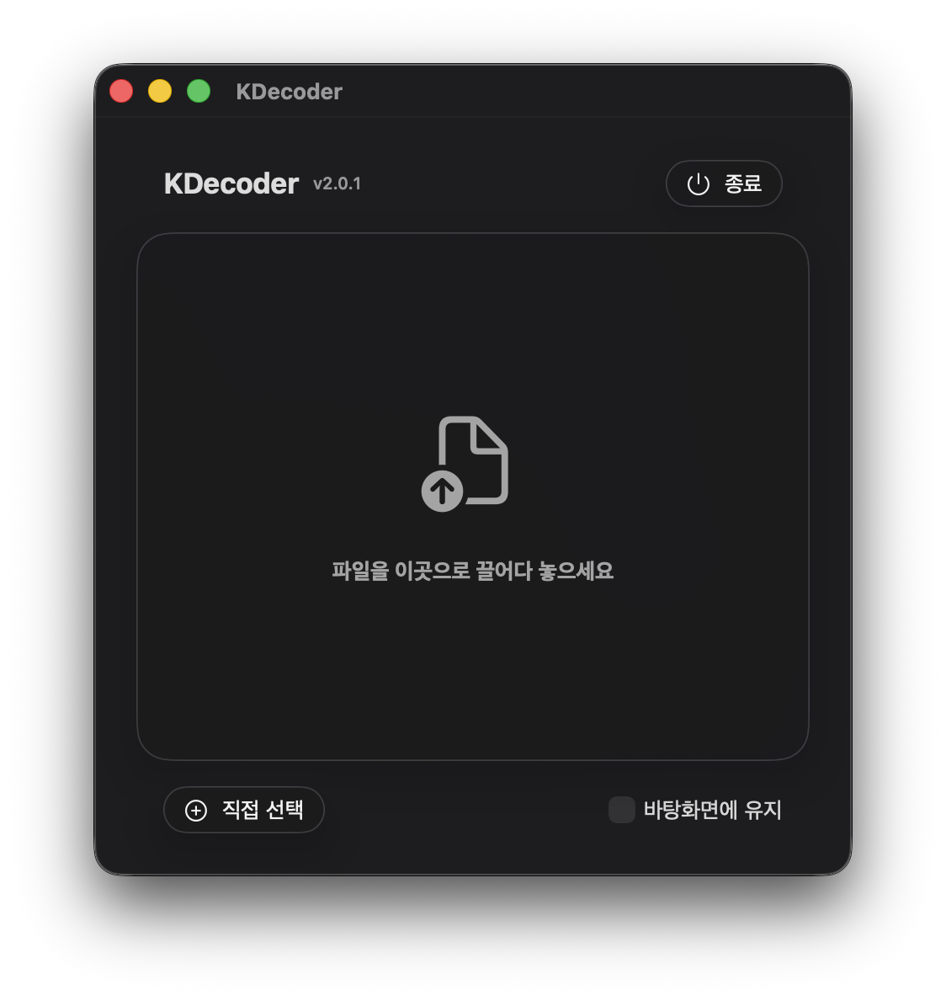

# KDecoder for Mac

> 윈도우에서 옮긴 한글 파일명이 깨질 때, 드래그 한 번으로 해결하는 macOS 메뉴바 앱

---

## 📌 소개

윈도우와 macOS 간에 파일을 이동할 때, **유니코드 정규화 방식의 차이(NFC ↔ NFD)** 로 인해 한글 파일명이 깨지는 문제가 발생합니다. **KDecoder**는 이런 깨진 파일명을 드래그 앤 드롭만으로 즉시 복원해 줍니다.

---

## ✨ 기능

- 🖱️ **드래그 앤 드롭** — 파일을 앱 창에 끌어다 놓으면 바로 파일명 복원
- 📂 **직접 선택** — 파일 선택기로 수동으로 파일 선택 가능
- 🖥️ **메뉴바 앱** — 메뉴바에 조용히 상주하며 필요할 때 바로 사용
- 💾 **바탕화면에 저장** — 원본 위치 대신 바탕화면에 복원된 파일 저장 옵션 제공
- ⚡ **다중 파일 처리** — 여러 파일을 한 번에 처리
- 🔁 **파일명 충돌 처리** — 동일한 이름의 파일이 있으면 자동으로 `_copy1`, `_copy2` 등을 붙여 처리
- 🔒 **샌드박스 & 개인정보 보호** — macOS 보안 범위 북마크를 사용한 안전한 폴더 접근

---

## 🚀 사용 방법

### 기본 사용법

1. **KDecoder 실행** — 앱이 화면 오른쪽 상단 메뉴바에 나타납니다
2. **메뉴바 아이콘 클릭** — 앱 창을 엽니다
3. **파일을 드롭 존에 끌어다 놓기** — 깨진 파일명이 자동으로 복원됩니다 ✅

### 직접 파일 선택

- 창 하단의 **"직접 선택"** 버튼 클릭
- 복원할 파일 선택
- 완료!

### 바탕화면에 유지 옵션

- **"바탕화면에 유지"** 체크박스를 켜면
- 복원된 파일이 원본 위치 대신 **바탕화면**에 저장됩니다

### 첫 실행 시 (폴더 접근 권한)

처음 실행하면 파일 접근 권한을 요청합니다. 팝업이 뜨면 파일이 있는 폴더에 대한 접근을 허용해 주세요.

---

## 📸 스크린샷

<!-- 스크린샷을 여기에 추가하세요 -->
<!-- 예시:


-->

> *스크린샷 준비 중*

---

## 🛠️ 요구 사항

- macOS 26.0 이상
- Apple Silicon 또는 Intel Mac

---

## 🏗️ 직접 빌드하기

```bash
git clone https://github.com/adgk2349/Korean_File_Name_Decoder_For_Mac.git
cd Korean_File_Name_Decoder_For_Mac
open KDecoder.xcodeproj
```

Xcode에서 빌드 후 실행 (⌘R)

---

## 💝 후원

KDecoder가 도움이 되셨다면 후원을 고려해 주세요!

[](https://www.paypal.com/paypalme/run1213)

---

## 📄 라이선스

MIT License © 2026 [adgk2349](https://github.com/adgk2349)
